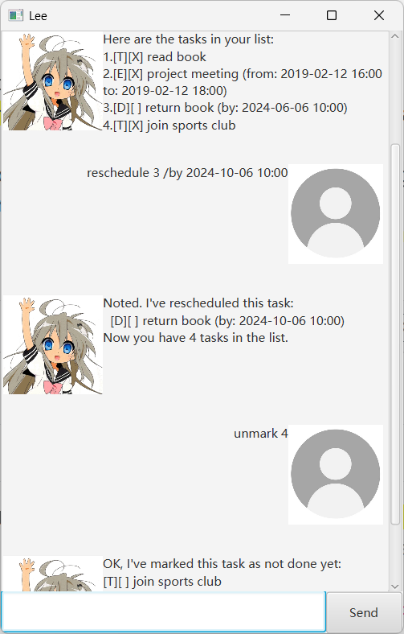

# Lee User Guide




#### Lee is a lightweight, easy-to-use and efficient task manager chat bot to help you keep tracks of your todos, events and deadlines!

## View all tasks

simply type `list`

Example outcome:
```
Here are the tasks in your list:
1.[T][ ] borrow book
2.[D][ ] return book (by: 2019-02-14 16:00)
3.[E][ ] project meeting (from: 2019-02-12 16:00 to: 2019-02-12 18:00)
```

## Adding todos

simply type `todo TASK` where `TASK` is the task description!


Example: `todo read book`

```
Got it. I've added this task:
  [T][ ] read book
Now you have 5 tasks in the list.
```

"T" means it's a task of type "ToDo", and "[ ]" means the task is not complete yet.

## Adding deadlines 

simply type `deadline TASK /by TIME` where `TIME` is the deadline which must be in the form of `yyyy-MM-dd HH:mm`

Example: `deadline return book /by 2019-02-14 16:00`

```
Got it. I've added this task:
  [D][ ] return book (by: 2019-02-14 16:00)
Now you have 2 tasks in the list.
```
"D" means it's a task of type "Deadline".

## Adding events

simply type `event TASK /from TIME /by TIME` where `TIME` must be in the form of `yyyy-MM-dd HH:mm`

Example: `event project meeting /from 2019-02-12 16:00 /to 2019-02-12 18:00`

```
Got it. I've added this task:
  [E][ ] project meeting (from: 2019-02-12 16:00 to: 2019-02-12 18:00)
Now you have 3 tasks in the list.
```
"D" means it's a task of type "Deadline".

## Delete tasks

simply type `delete INDEX` where `INDEX` is the index of the task you want to delete. Index can be find using list view.

Example: `delete 1`

```
Noted. I've removed this task:
  [T][ ] borrow book
Now you have 2 tasks in the list.
```

## mark and unmark tasks
simply type `mark INDEX` to mark and `unmark INDEX` to unmark a task.

Example: `mark 1`

```
Nice! I've marked this task as done:
[T][X] borrow book
```

And: `unmark 1`

```
OK, I've marked this task as not done yet:
[T][ ] borrow book
```

## search task by description
simply type `find KEY` where `KEY` is the keyword to search in descriptions.

Example: `find book` 

```
Here are the matching tasks in your list:
1.[T][X] read book
2.[D][ ] return book (by: 2024-10-06 10:00)
3.[T][ ] read book
```

## reschedule deadline tasks
simply type `reschedule INDEX \by TIME` where `INDEX` is the index of the Deadline you want to
reschedule and `TIME` should be in the format of `yyyy-MM-dd HH:mm`

Example: `reschedule 3 /by 2024-10-06 10:00`

```
Noted. I've rescheduled this task:
  [D][ ] return book (by: 2024-10-06 10:00)
Now you have 5 tasks in the list.
```

## exit
simply type `bye` and Lee will wave you goodbye!

## Automatic warnings when:
- Incorrect command format is used
- Invalid time format is used
- Invalid task index is used

# Hope you enjoy your time with Lee!